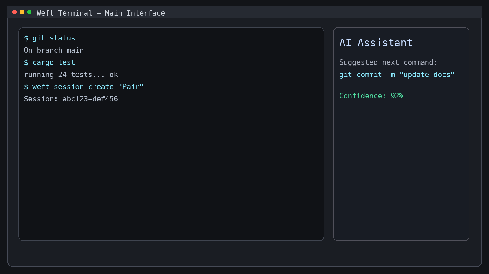
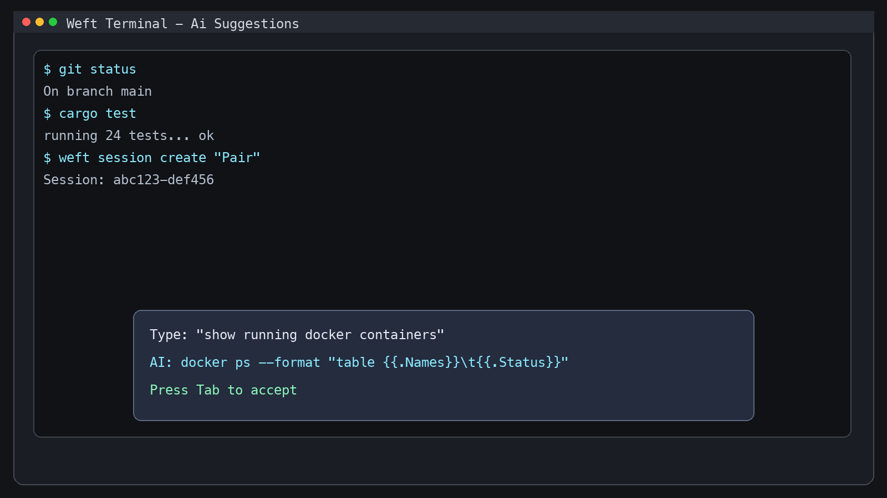
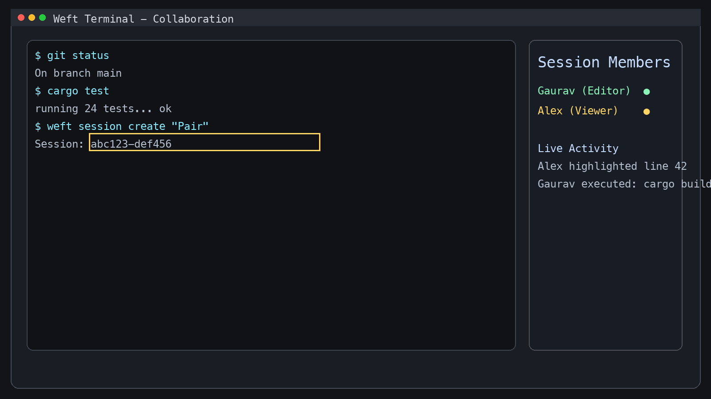
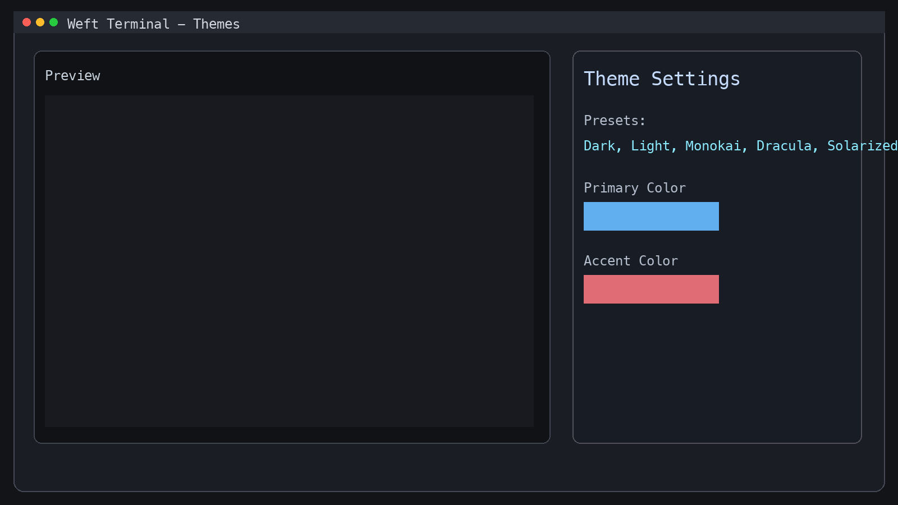
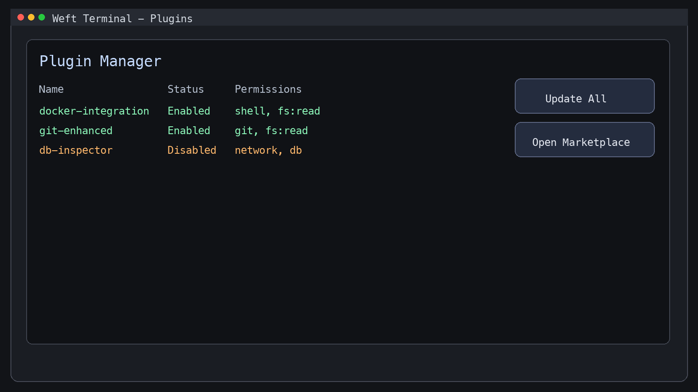
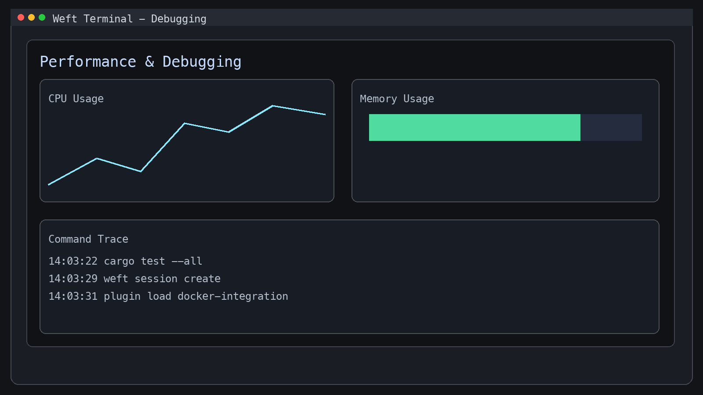
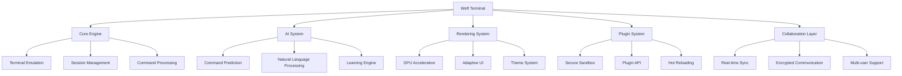

# Weft Terminal

**Next-generation AI-powered terminal development environment**

Weft is a modern terminal that combines powerful AI capabilities with collaborative features and extensible plugin architecture. Built with Rust for performance and safety, Weft provides an advanced development environment designed for modern workflows.

## �️ Interface Preview

### Main Terminal Interface


The Weft Terminal features a clean, modern interface with:
- **Command Input Area**: Intelligent autocomplete and AI suggestions
- **Output Display**: Syntax-highlighted terminal output
- **AI Assistant Panel**: Contextual help and command predictions
- **Session Management**: Multiple terminal tabs with independent state

### AI-Powered Command Assistance


Experience intelligent command completion with:
- **Natural Language Processing**: Type "show running processes" and get `ps aux`
- **Context-Aware Suggestions**: Commands adapt to your current directory and recent activity
- **Learning Engine**: Improves suggestions based on your usage patterns
- **Multi-Model Support**: Choose between local Ollama models or cloud APIs

### Real-Time Collaboration


Work together seamlessly with:
- **Live Session Sharing**: Multiple users in the same terminal session
- **Cursors and Highlighting**: See other users' actions in real-time
- **Encrypted Communication**: Secure end-to-end encryption for sensitive work
- **Role-Based Permissions**: Control who can execute commands vs. observe

### Theme Customization


Personalize your workspace with:
- **Built-in Themes**: Dark, Light, Monokai, Dracula, Solarized
- **Custom Themes**: Create your own color schemes
- **Real-Time Switching**: Change themes without restarting
- **Font Configuration**: Full control over fonts, sizes, and rendering

### Plugin Management


Extend functionality with:
- **Secure Plugin System**: Sandboxed execution with permission controls
- **Rich Plugin API**: Comprehensive access to terminal features
- **Hot Reloading**: Develop plugins with live updates
- **Plugin Marketplace**: Discover and install community extensions

### Performance & Debugging


Monitor and optimize with:
- **Real-time Performance Metrics**: CPU, memory, and network usage
- **Command Tracing**: Detailed execution history and timing
- **Memory Profiling**: Detect leaks and optimize allocations
- **Network Inspection**: Monitor API calls and data transfer

## �� Key Features

### 🤖 AI-Powered Intelligence
- **Smart Command Prediction**: Contextual command suggestions based on your workflow
- **Natural Language Processing**: Execute commands using natural language descriptions
- **Learning Engine**: Adapts to your patterns and improves over time
- **Multi-Model Support**: Compatible with Ollama, OpenAI, Anthropic, and custom models

### 🎨 Modern Rendering
- **GPU-Accelerated**: Smooth 60+ FPS rendering using wgpu
- **Adaptive UI**: Responsive interface that adapts to your workflow
- **Custom Themes**: Extensive theming system with real-time switching
- **Font Rendering**: Crisp text rendering with full Unicode support

### 🤝 Real-Time Collaboration
- **Session Sharing**: Share terminal sessions with team members
- **Live Collaboration**: Work together in the same terminal session
- **Encrypted Communication**: Secure end-to-end encryption for sensitive data
- **Multi-User Support**: Multiple participants with role-based permissions

### 🔧 Extensible Plugin System
- **Secure Architecture**: Sandboxed plugin execution with permission controls
- **Rich API**: Comprehensive plugin API for extending functionality
- **Plugin Marketplace**: Discover and install community plugins
- **Hot Reloading**: Develop plugins with live reloading

### 🐛 Advanced Debugging
- **Performance Profiling**: Real-time performance monitoring and optimization
- **Memory Analysis**: Track memory usage and detect leaks
- **Command Tracing**: Detailed command execution history and analysis
- **Network Inspection**: Monitor network activity and API calls

### ⚡ Performance Optimized
- **Task Scheduling**: Intelligent task prioritization and parallel execution
- **Memory Pooling**: Efficient memory management with custom allocators
- **Frame Optimization**: Adaptive rendering quality for smooth performance
- **Resource Management**: Smart resource allocation and cleanup

## � Architecture Overview



## 📊 Performance Characteristics

| Metric | Value | Description |
|--------|-------|-------------|
| **Memory Usage** | ~50MB idle | Efficient memory management |
| **Startup Time** | <100ms | Fast initialization |
| **Rendering** | 60+ FPS | GPU-accelerated display |
| **AI Response** | <200ms | Local model processing |
| **Collaboration Latency** | <50ms | Real-time synchronization |
| **Plugin Load Time** | <500ms | Hot-swappable modules |

## 📦 Installation

### From Source

```bash
# Clone the repository
git clone https://github.com/sisodiabhumca/Weft.git
cd Weft

# Build the project
cargo build --release

# Run the terminal
./target/release/weft
```

### Package Managers (Coming Soon)

- **Homebrew**: `brew install weft-terminal`
- **Cargo**: `cargo install weft-terminal`
- **Snap**: `snap install weft-terminal`

## 🚀 Quick Start

1. **Launch Weft**
   ```bash
   weft
   ```

2. **Enable AI Features**
   ```bash
   weft config set ai.enabled true
   weft config set ai.provider ollama
   ```

3. **Start Collaborating**
   ```bash
   weft session create "Dev Session"
   weft session share <session-id>
   ```

4. **Install Plugins**
   ```bash
   weft plugin install docker-integration
   weft plugin install git-enhanced
   ```

## 🎯 Usage Examples

### AI-Powered Commands

```bash
# Natural language command execution
> "list all running docker containers"
# Weft translates to: docker ps

# Contextual suggestions
> git <TAB>
# Suggestions: status, add, commit, push, pull...
```

### Collaboration

```bash
# Create a shared session
> weft session create "Pair Programming"
# Session ID: abc123-def456

# Share with teammate
> weft session invite abc123-def456 user@example.com

# Join existing session
> weft session join abc123-def456
```

### Plugin Development

```rust
// Example plugin
use weft_terminal::prelude::*;

#[weft_plugin]
pub struct MyPlugin {
    // Plugin state
}

#[weft_command]
fn my_command(ctx: &Context, args: Vec<String>) -> Result<()> {
    ctx.terminal().output("Hello from plugin!");
    Ok(())
}
```

## 🔧 Configuration

Weft uses TOML configuration files located at:
- **Config**: `~/.config/weft/config.toml`
- **Plugins**: `~/.weft/plugins/`
- **Themes**: `~/.weft/themes/`

### Example Configuration

```toml
[terminal]
shell = "/bin/zsh"
font_family = "JetBrains Mono"
font_size = 14.0
cursor_blink = true

[ai]
enabled = true
provider = "ollama"
model = "codellama"
auto_suggestions = true

[rendering]
renderer = "wgpu"
vsync = true
theme = "dark"
gpu_acceleration = true

[collaboration]
enabled = true
encryption_enabled = true
auto_sync = true

[plugins]
enabled = true
auto_load = true
security_policy = "prompt"
```

## 🎨 Themes

Weft includes several built-in themes:
- **Dark**: Classic dark theme
- **Light**: Clean light theme
- **Monokai**: Popular syntax highlighting theme
- **Dracula**: Elegant dark purple theme
- **Solarized**: Eye-friendly color scheme

### Custom Themes

Create custom themes in `~/.weft/themes/`:

```toml
[theme]
name = "My Theme"
background = "#1e1e1e"
foreground = "#d4d4d4"
cursor = "#ffffff"

[colors]
primary = "#61afef"
secondary = "#98c379"
accent = "#e06c75"
warning = "#e5c07b"
error = "#f92672"
```

## 🔌 Plugin Development

### Getting Started

1. **Create Plugin Structure**
   ```bash
   mkdir my-weft-plugin
   cd my-weft-plugin
   cargo init --lib
   ```

2. **Add Weft Dependency**
   ```toml
   [dependencies]
   weft-terminal = "0.1.0"
   ```

3. **Implement Plugin**
   ```rust
   use weft_terminal::prelude::*;

   #[weft_plugin]
   pub struct MyPlugin {
       counter: u32,
   }

   impl Plugin for MyPlugin {
       fn new() -> Self {
           Self { counter: 0 }
       }
       
       fn commands(&self) -> Vec<Command> {
           vec![
               Command::new("mycmd", self::my_command),
           ]
       }
   }

   impl MyPlugin {
       fn my_command(&mut self, ctx: &Context, args: Vec<String>) -> Result<()> {
           self.counter += 1;
           ctx.terminal().output(&format!("Command called {} times", self.counter));
           Ok(())
       }
   }
   ```

4. **Build and Install**
   ```bash
   cargo build --release
   weft plugin install ./target/release/libmy_plugin.so
   ```

## 🐛 Debugging and Profiling

### Performance Monitoring

```bash
# Enable performance monitoring
weft config set debugging.performance_monitoring true

# View performance metrics
weft debug performance

# Generate performance report
weft debug report --session-id <id>
```

### Memory Profiling

```bash
# Enable memory profiling
weft config set debugging.memory_profiling true

# View memory usage
weft debug memory

# Detect memory leaks
weft debug leaks
```

### Command Tracing

```bash
# Enable command tracing
weft config set debugging.command_tracing true

# View command history
weft debug history

# Trace specific command
weft debug trace --command "docker build"
```

## 🤝 Contributing

We welcome contributions! Please see our [Contributing Guide](CONTRIBUTING.md) for details.

### Development Setup

```bash
# Clone repository
git clone https://github.com/weft-terminal/weft.git
cd weft

# Install dependencies
cargo build

# Run tests
cargo test

# Run with debug features
cargo run --features debug
```

### Code Style

We use `rustfmt` and `clippy` for code formatting and linting:

```bash
cargo fmt
cargo clippy -- -D warnings
```

## 📄 License

This project is proprietary software - All Rights Reserved to Gaurav Sisodia.

See the [LICENSE](LICENSE) file for details. Permission is granted for evaluation purposes only.

## 🙏 Acknowledgments

- **Alacritty** - Terminal emulation inspiration
- **Neovim** - Plugin architecture ideas
- **Rust Community** - Excellent ecosystem and tools
- **Open Source Projects** - Various libraries and frameworks that make Weft possible

## 📞 Support

- **Documentation**: [docs.weft.dev](https://docs.weft.dev)
- **Discord**: [Join our community](https://discord.gg/weft)
- **Issues**: [GitHub Issues](https://github.com/sisodiabhumca/Weft/issues)
- **Email**: support@weft.dev

---

**Weft Terminal** - Where terminal meets intelligence 🚀
